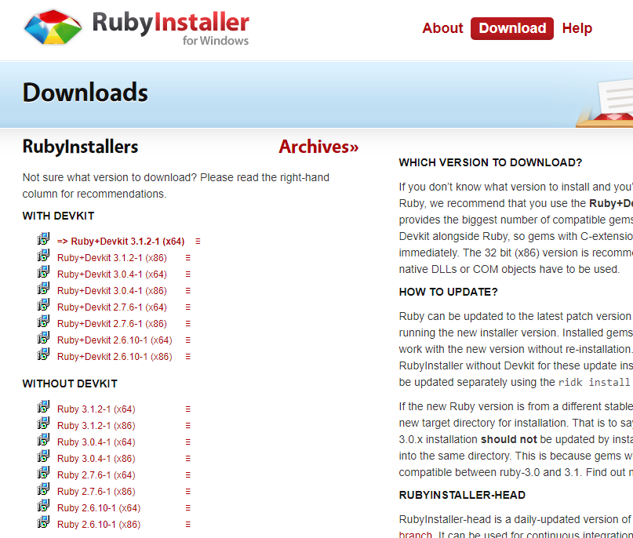

# Environment Setup

[GitHub Desktop](#GitHub Desktop)

[Visual Studio Code](#Visual Studio Code)

[Jekyll](#jekyll)

[Typora](#Typora)

## GitHub Desktop

https://desktop.github.com/

GitHub Desktop use for git repository management


git clone repository into your local computer


Change will display, and to apply the change, write down the commit message (on left bottom) and click Commit to main


Then click push origin (on  top middle black bar)


## Visual Studio Code

https://code.visualstudio.com/

Visual Studio Code as Editor


## Jekyll

Reference: https://jekyllrb.com/docs/installation/windows/

Jekyll is core to build and run website

Following is the installation guideline for **Windows**, please check the official documentation for other operating systems

Download RubyInstallers: https://rubyinstaller.org/downloads/



Download link on left side (WITH DEVKIT), the first one

After run it, following will show on screen:


Click Finish, 


Press Enter to install by default


Press Enter again to close

After it, close terminal and open a new one, run:

```
gem install jekyll bundler
```


To check is it installed, run:

```
jekyll -v
```

Go under root of repository, run:

```
bundle install
```


To start server, run:

```
bundle exec jekyll serve
```

It is same as what `run.ps1` do


It will running on 127.0.0.1:4000, you can check out it for development preview

## Typora

https://typora.io/releases/all

Typora use for editing markdown file (.md)

Typora start to charge after version 1.0.0

You can download 0.11.18 version in <u>History Releases</u> > <u>Dev / Beta Releases</u> > <u>More Beta</u> > <u>old Windows / Linux beta</u>