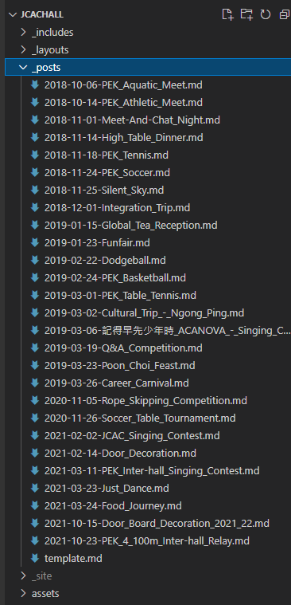
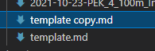
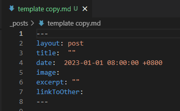

# Update Post

Posts are store in `_post/`



For new post, copy template.md



Content of template as following:



Remember rename the file to format `year-month-day-title.md`, otherwise it will not show

Under the [Front Matter](https://jekyllrb.com/docs/front-matter/), it is content, you can create post as what markdown wrote

For the attribute:

```
title:  ""
date:  2023-01-01 08:00:00 +0800
image: 
excerpt: ""
linkToOther: 
```

`title`, `date` worthy of the name

`image` is image url (link)

`excerpt` is a text, will display under post image

`linkToOther` is a url, it is optional, can be empty

if `linkToOther` not empty, link of the post will redirect to the link, 

In the past, many posts were built on WeChat, so design this attribute

Preview in local will `run.ps1`, commit to GitHub and it will rebuild github page